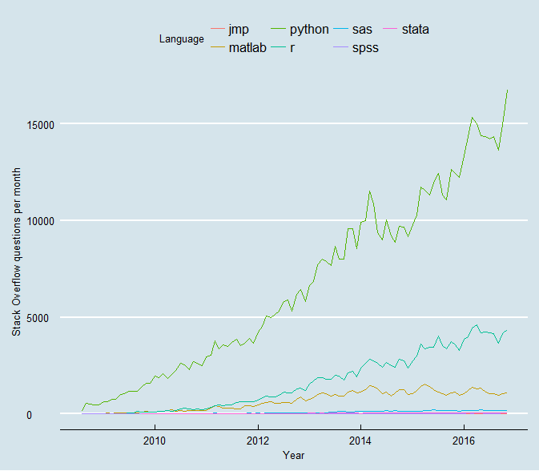

As time goes on, this blog will touch on many of the technical choices made at Health Catalyst. It will mostly focus on data science. If there's a particular topic that interests, [contact us](http://healthcare.ai/contact.html)! Some posts will be short, while others will be in-depth. The tone will be informal, with a focus on content and frequent posts (twice per-week) rather than polish. When we talk about doing things with data, we'll post the code, so you can follow along.

When doing healthcare machine learning, why'd we choice R and Python? To be honest, this decision wasn't that complicated. Of course, there are a lot of fantastic statistical tools available today besides just R and Python: Matlab, SAS, Stata, SPSS, and others. While languages like Java, C++, and C# are great, they're [compiled](https://en.wikipedia.org/wiki/Compiled_language), which makes them difficult to use for data analysis. We had just a few criteria when narrowing down the list.

1. Was it open-source? 
2. Could it do breadth and depth? 
3. Did it have wide support?

We wanted something open-source, because free is obviously great, but also because we wanted to be able to contribute to the same community. Data literacy is important to getting started in most professional careers, and it's fantastic how free tools have democratized entry into many fields over the last decade--we want to support that.

R and Python are the obvious open-source options when playing with data, but how are they on breadth and depth as well as community support? Actually pretty fantastic. Python is often known as the Swiss Army knife of programming languages--it can support machine learning, web development, web scraping, desktop applications, etc. It also supports these things well.

While R is more narrowly focused on statistics compared to Python, it is also great at several things. First, it offers well-documented algorithms and tools for [*whatever*](https://cran.r-project.org/web/views/) you want to do in statistics. Second, it has fantastic [visualization software](http://tutorials.iq.harvard.edu/R/Rgraphics/Rgraphics.html) (better than Python, it could be argued), and thirdly it is great at professional [document generation](http://yihui.name/knitr/) for both reports and data education.

In terms of support, here's a plot showing the popularity of each of these languages over time on [Stack Overflow](http://stackoverflow.com/), a popular Q and A site:

While there are many other options for doing statistics in healthcare, R and Python are among the very best, and we're excited to use them to improve patient care.

Note: We obtained data using [this tool](https://data.stackexchange.com/stackoverflow/query/596780/language-trends-questions-per-tag-per-month); we [plotted using R](https://gist.github.com/levithatcher/130ee5d6586839ceeb3975e0afee9b65). For comparison, note that for November 2016 the Stack Overflow question break-down was Python (16,759); R (4,346); Matlab (1,101); SAS (190); Stata (46); SPSS (25); and JMP (2), though the Python numbers are inflated, as it's used for much more than statistics. 