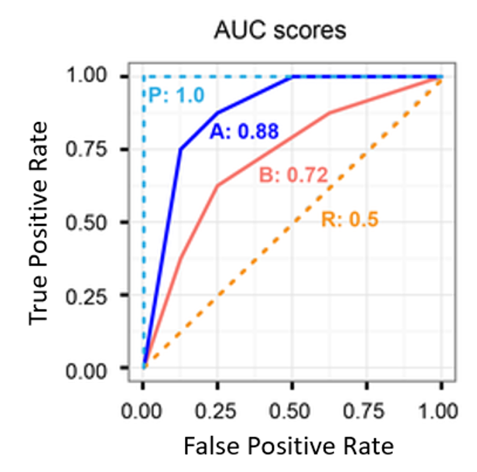

Before a new technique in healthcare can be introduced to patient use, it must pass a rigorous set of quality standards. Then, to actually be adopted and see widespread use, a technique must be trusted and accepted by physicians and other front line care workers. For example, new drugs are evaluated in several steps before making into human trials, and then still have several hurdles to clear before they can be accepted as standard of care. Machine learning is poised to make a significant impact in clinical care in the near future, but it is not exempt from these same checks and developmental hurdles. 

The main goal of the healthcare.ai is to improve healthcare outcomes. As detailed in a previous post, we provide the tools and models that can use existing data to help intelligently guide clinical decisions. There has to be trust and transparency in these models if they are to make an impact and see long-term adoption. Just like a new drug, every model we build is evaluated to make sure that it’s high-quality before it is pushed into production. We evaluate models to compare them with other techniques, know when in their development they are ready for production, and to get an overall sense of how much we should trust them. Interestingly enough, one common way to do this (at least in classification problems) borrows from other areas of medicine and uses a *Receiver Operating Characteristic Curve (ROC).*

Before we can get to the curve itself, we need a few definitions. Let’s say we’ve generated a machine learning model to predict the likelihood of 30-day readmission in a set of patients. The model gives a probability (between 0 and 1) for each person of how likely they are to be readmitted. 30 days later, the *True Positive Rate (TPR)* is the proportion of actual readmissions that the test correctly predicted would be readmitted. The *False Positive Rate (FPR)* is the proportion of patients whom the model predicted would be readmitted, but were not. In order to make these black and white predictions, we must pick a decision boundary somewhere between 0 and 1. Remember, the model gives a probability, not a definitive answer. If we were to choose 0.9, we would say that everyone with readmittance probability above 0.9 is a readmission, everyone below is not. We could then calculate the TPR and FPR, and have a measure of how well our model performed at 0.9 decision boundary. As you might have guessed, the decision boundary is a sticky spot. If we were choose 0.8 to increase the TPR, it will come at the expense of a larger FPR. The three parameters are tied to one another in a way that makes models hard to interpret and discuss. 

 The ROC is a common way to avoid this. It is a graphical representation of the balance between TPR and FPR at *every* possible decision boundary. The Area Under the Curve (AUC) is that magic solution that we have been looking for. The AUC is a single number that can evaluate a model’s performance, regardless of the chosen decision boundary. The perfect machine learning model will have an AUC of 1.0 (cyan), while a random one will have an AUC of 0.5 (orange). A good model will be over 0.7, a great one will be over 0.85. It might not be possible to perfectly classify a data set, but the AUC is a good way to compare models on that data, across patient cohorts, and give a sense of how trustworthy that model is in general. 

Whenever we are getting ready to deploy a model into use, we need to evaluate its overall performance. The AUC gives us a transparent, easy-to-interpret way to do that. Of course, it has limitations. For example, the usefulness of the ROC curve begins to break down with heavily imbalanced classes, obviously a big problem for healthcare data. One solution is to use AUC from a Precision-Recall Curve, but we’ll save that for a future post. If you’re interested in trying out ROC curves on your data, you’ll find some handy tools already built into the healthcare.ai package to help you evalutate your models. Finally, if you’re hungry for more, there are many [great tutorials online](https://classeval.wordpress.com/introduction/introduction-to-the-roc-receiver-operating-characteristics-plot/) for ROC curves. 

Thanks for reading and please [reach out](http://healthcare.ai/contact) with any questions or comments!
