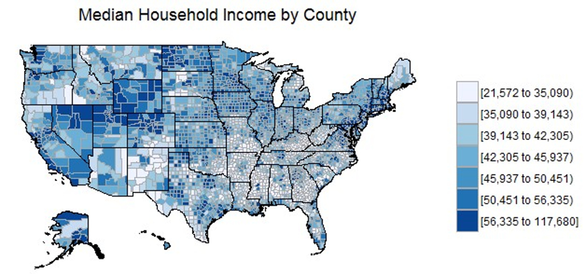
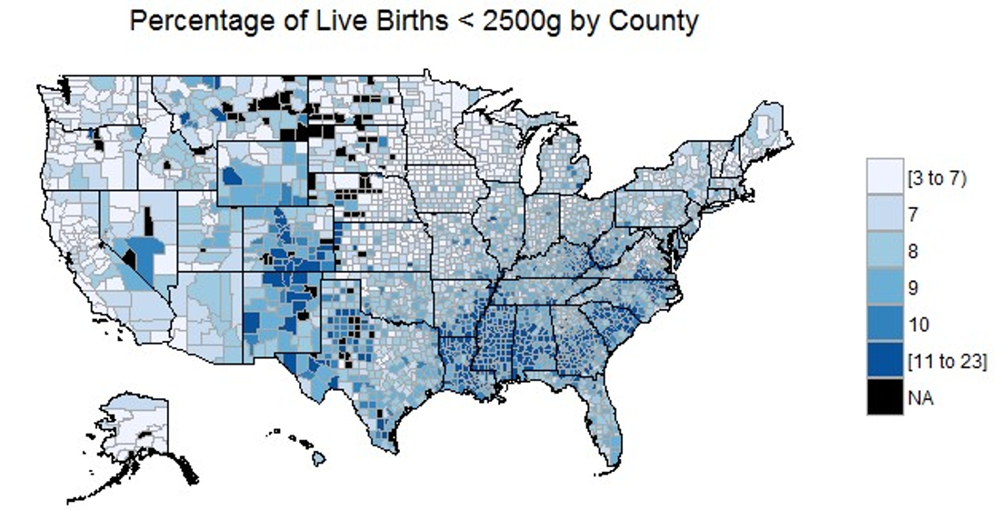
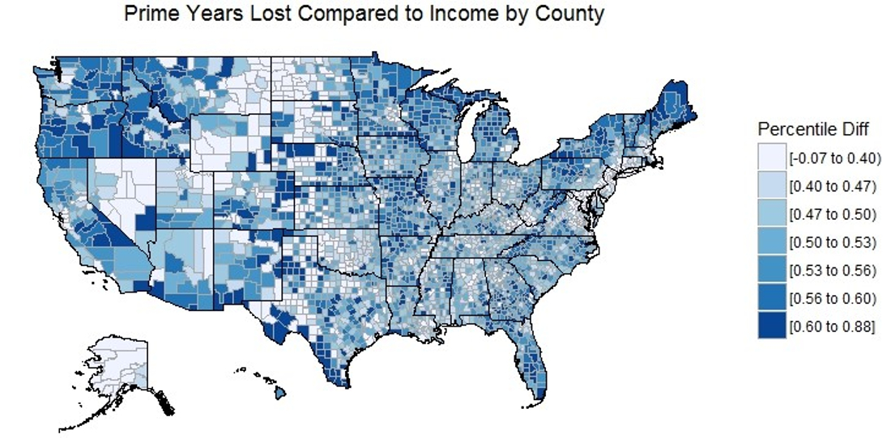

While our previous posts have focused on healthcare machine learning, we’re also excited to post analyses of health data using R and Python. We do this to hopefully elevate the national discussion around health data, enhance the community’s understanding of health in the United States (US), and provide guidance as to how communities and health systems might increase the quality and length of people’s lives. Health Catalyst is an outcomes improvement company, and we realize that the inpatient setting is only one of several venues that affect a person’s health trajectory. Understanding the big picture of health is another way to approach outcomes improvements. These posts will not only attempt to educate on findings about health, but also on how to use R/Python for health data analysis, so we’ll always post links to the [relevant code](https://gist.github.com/levithatcher/070496ca48c165d7ced37e0ffcd24dc7).

Those who have been in healthcare for any significant amount of time have heard that social determinants of health (SDOH) are important to healthcare outcomes. While it’s hard to overstate the importance of these factors, they’re often not well understood and overshadowed by inpatient optimizations when discussing outcomes improvement. This post is the first in a series where we’ll attempt to untangle the drivers behind population health differences across the US. Today we'll talk about where the US stands from region to region in terms of social determinants of health. In subsequent posts we'll discuss whether these differences mostly related to income, air pollution, access to healthy food, long commutes, access to healthcare, opioid addiction, or alcohol abuse.

To try and answer that we’ll [use R](https://gist.github.com/levithatcher/070496ca48c165d7ced37e0ffcd24dc7) and [data](http://www.countyhealthrankings.org/sites/default/files/2015%20CHR%20Analytic%20Data.csv) from [countyhealthrankings.org](http://www.countyhealthrankings.org/), which is a fantastic resource on SDOH comparisons by county. We'll start by presenting a choropleth map of median household 2015 [income by county](http://www.countyhealthrankings.org/measure/median-household-income):

Of course, what we find is that there are large regional differences in household income. Broadly, the Northeast, the West Coast, and metropolitan areas are associated with higher personal incomes, compared with rural areas and the South. Note that occasionally there is high intra-state variation, such as in Texas, compared to the more uniform median incomes across counties in Minnesota. But how do these regional variations in incomes correspond with healthcare outcomes? Data on [Low Birth-Weight](http://www.countyhealthrankings.org/measure/low-birthweight) (LBW), i.e., live births under ~5 lbs 8 oz (2500 g), provides a [helpful link](https://www.ncbi.nlm.nih.gov/pubmed/7633862) between social determinants and actual healthcare outcomes, as

> “[LBW indicates maternal exposure to health risks](http://www.countyhealthrankings.org/measure/low-birthweight) in all categories of health factors, including her health behaviors, access to health care the social and economic environment she inhabits, and environmental risks to which she is exposed. In terms of the infant’s health outcomes, LBW serves as a predictor of premature mortality and/or morbidity over the life course and for potential cognitive development problems.” 
 
Pulling data from [here](http://www.countyhealthrankings.org/measure/low-birthweight), and [processing with R](https://gist.github.com/levithatcher/070496ca48c165d7ced37e0ffcd24dc7), we plot the percentage of county live births with birth-weight under 5 lbs 8 oz:

While there’s a lot that could be unpacked here, we’ll simply note that the same regions that had lower personal incomes also have a higher percentage of LBW. Not a huge surprise—it is surprising, however, how much intra-state variation is present (like in NV and CO) and how the Deep South has rates of LBW that are often twice that of Minnesota and Wisconsin.

While income appears to be associated with new-born morbidity and mortality, how does it affect populations later in life? We use [premature mortality](http://www.countyhealthrankings.org/measure/premature-death-ypll) [data](http://www.countyhealthrankings.org/sites/default/files/2015%20CHR%20Analytic%20Data.csv) from [countyhealthrankings.org](http://www.countyhealthrankings.org/), where a premature death is defined as occurring before 70 years of age, to answer this question. For each county, per 100k people, the years of death before 75 are summed. Think of it as incidence of early death, per county:

  
Compared to LBW, it appears that premature mortality more closely corresponds with median county income. Note how the high incidence of premature mortality across Arkansas, Tennessee, and Kentucky closely tracks income (comparing with the first figure). Broadly, Appalachia appears to suffer more from deaths of prime-age adults compared to LBW (while the South appears to suffer greatly from both). Note that while the rust belt (i.e., PA, OH, IN, MI, IL, and WI) certainly has other issues, they seem to be doing a good job of keeping prime-age people alive, especially compared to Appalachia and the Deep South. 

While it’s old-hat to say that population health in the Deep South isn’t fantastic, let’s go one step further and see which counties in the US punch above their weight when it comes to using resources effectively. In other words, which counties are doing well for how poor they are. This is the metric that will let us understand what it is that poor and middle-income counties do well in terms of keeping people healthy.

To get at this, we create percentiles for each county in terms of LBW (where 100 is best) and then subtract (for each county) the percentiles for income. We can call this the county Punch-Above-Their-Weight Index or PATWI for short. Before plotting the entire country, let’s look at LBW PATWI for the top ten counties in terms of income:

First, in this and the following tables, the PATWI column is just the fifth column minus the fourth column. While the counties above do have good scores in terms of LBW, it’s difficult for rich counties to punch above their weight, since they’re the 800-lb gorillas. We do, however, see the benefit of the PATWI, since the richest counties in the US *aren’t* those with the best LBW scores.

Which counties have the best LBW, considering their income?
 

It’s impressive that these counties, which have median incomes one-third of that of Loudoun County (VA), have better LBW scores than Loudoun County. Note that the best LBW PATWI scores come from a scattered grouping of states, although, Michigan (MI) impressively has three entries and Missouri (MO) has two. That’s definitely good news for MI and MO public health officials. Note that this PATWI measure doesn’t just bias towards the poorest counties, either. While Buffalo County, SD—perhaps the poorest county in the nation—has a high LDW PATWI score, none of the counties from the Deep South or Appalachia show up in this list. Here’s LDW PATWI score for all counties:

 

Note that positive values here denote that the county is doing better at LBW than expected, based on their income*. Amongst other findings, we see that even though northern half of West Virginia is quite poor, they’re doing better than expected at helping mothers carry and deliver healthy babies. The Deep South, however, is doing about as poorly (or worse) than one would expect by looking at their income along. Note that Missouri is doing better than expected, as is rural Oregon, Minneapolis, and Wisconsin. Recall that metro areas tend to be richer than rural areas, so it’s impossible for richest areas like the Bay Area and NYC tend to have a high score (since their percentiles can’t go over 100)—this limitation makes this plot more of a measure of how middle and low income counties are doing relative to their income.
Let’s do the same for the premature mortality metric we discussed above—in other words, which counties are doing a great job of avoiding early mortality. We’ll start with the richest counties:

 
Yup, the richest counties are great at keeping people alive—even more so than avoiding low birth-weight (compare with the first table above). But, which poor or middle income counties are best at punching above their weight when it comes to keeping their citizens alive?
  

It’s impressive how these relatively poor counties are achieving the top 10-20th percentile in terms of avoiding premature deaths (note that we’re using higher percentiles to mean good outcomes). It is an interesting mix of counties, indeed. Santa Cruz (AZ), Presidio County (TX), and Maverick County (TX) border Mexico; Crowley County (CO) has the largest per-capita prison population in the country. Madison County, home to BYU-Idaho, is [~80% Mormon](http://www.slate.com/articles/life/map_of_the_week/2012/02/mormon_population_in_the_u_s_an_interactive_map.html), which likely means that county overall has low rates of alcohol, tobacco, and drug dependency. In a future post we’ll go into how certain counties are punching above their weight, and for now offer the national view of premature-death PATWI score:

Recall that darker means that the county is doing well. At this level, what we notice is that Wisconsin, Michigan, and Missouri are doing a good job keeping prime-age people alive compared to Nevada and Wyoming. Knowing why this is occurring can significantly change how a health system interacts with its patients.

At Health Catalyst, we strive to understand the significant way social determinants of health can affect decision making at health systems from the Deep South to the Bay Area. Our clients are located all across the continent. High-value improvements in one health system are not necessarily the best everywhere, and we’d be cheating ourselves to only look for improvements at inpatient units. We’re committed to leveraging the tools of population health to improve patient outcomes across the board. 
This post is the first of many on population health, and in a future post we’ll dig more into which social determinants are most driving regional variations of LBW and premature death.

Thanks for reading and please [reach out](http://healthcare.ai/contact) with any questions or comments!

\* The distribution of county median income has a long tail, which means that when subtracting county income percentiles from the corresponding LBW or premature death percentiles, the result is typically positive. 